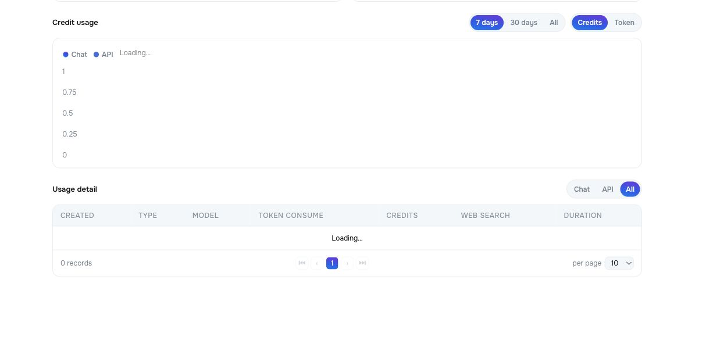
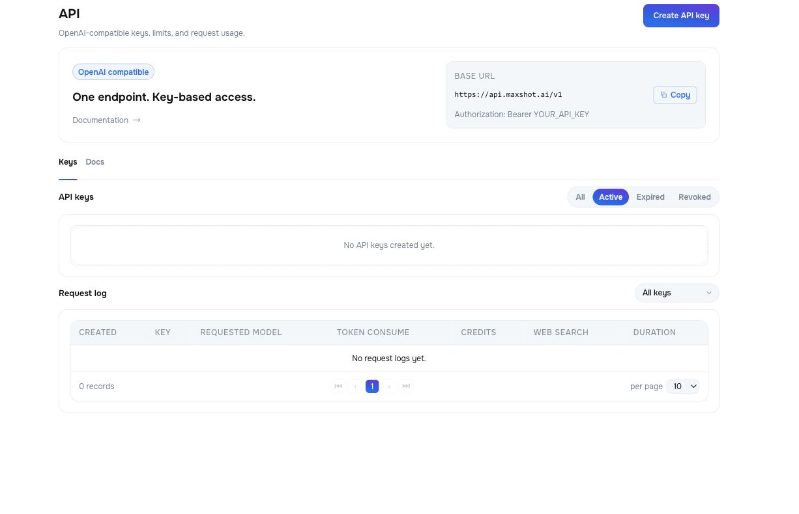
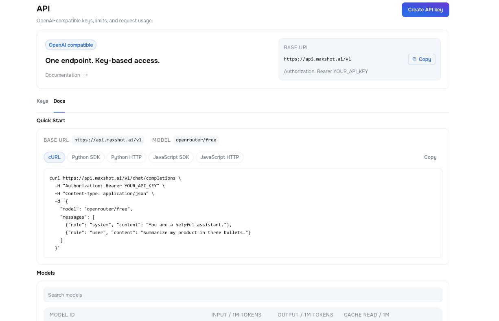
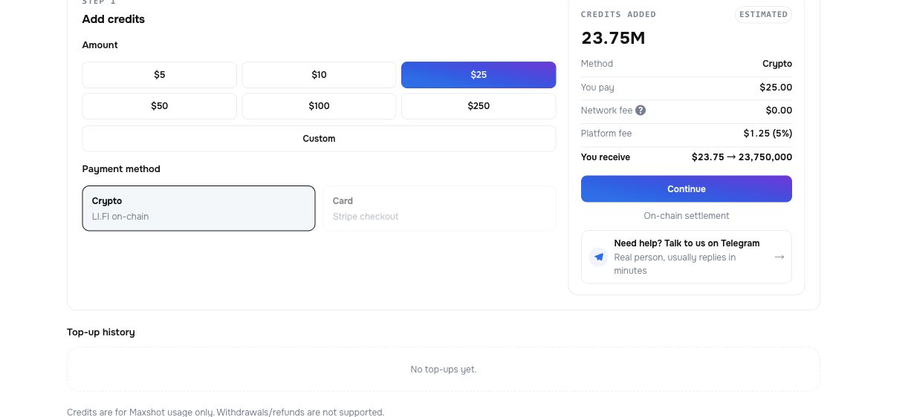

# Maxshot Gateway User Guide

- **Release:** 1.0
- **Audience:** People using the Gateway console for Chat, API access, usage review, Credits, referrals, and account settings
- **Last reviewed:** August 7, 2026
- **Console:** [gateway.maxshot.ai](https://gateway.maxshot.ai)
- **Product overview:** [Maxshot Gateway Product Guide](./MAXSHOT_GATEWAY_PRODUCT_GUIDE.md)
- **Detailed reference:** [Maxshot Gateway Product Document](./MAXSHOT_GATEWAY_PRODUCT_DOCUMENT.md)

## Who This Guide Is For

This guide is for:

- **Chat users** who want to choose a model, send messages, use attachments or optional tools, and manage conversation history.
- **API users** who need to create a key, copy integration settings, and review request activity.
- **Account owners** who need to monitor usage, add Credits, use a referral link, or update profile settings.
- **Support and onboarding teams** who help users complete the main Gateway workflows.

After reading this guide, you will know how to navigate the console, complete the core Chat and API workflows, add Credits, review consumption, and resolve common operating issues.

Screenshots show the Release 1.0 web console. Model names, prices, balances, limits, and enabled login methods can change. Always use the values shown in your account.

## 1. Sign In and Navigate

1. Open [gateway.maxshot.ai](https://gateway.maxshot.ai).
2. Select an available OAuth provider or connect a supported wallet.
3. For wallet login, approve the sign-in message. This proves address ownership; it does not submit an on-chain transaction or expose your private key.
4. After login, use the left navigation to open **New Chat**, **Usage**, **API**, **Credits**, **Referral**, or **Profile**.

If you received a referral code, enter it before signing in or open the referral link supplied by the inviter.

## 2. Start a Chat

Open **New Chat**. Enter a message in the composer and press **Enter** or select **Send**. The response streams into the conversation; select **Stop** to end generation early.


### Choose a model

Select the model name in the application header to open the model catalog. Review each model's capability labels before selecting it. The available list and prices can change.

You can also enable **Auto model** in the composer. Auto model uses the configured default model and locks manual model selection until you turn it off.

### Use the composer controls

The controls below the message field provide these actions:

| Control | What it does |
|---|---|
| Add attachment | Adds a supported file to the next message. Confirm that the selected model supports the file type. |
| Auto model | Uses the configured default model instead of a manually selected model. |
| Temporary chat | Prevents the conversation from being saved to history. |
| Web search | Allows this Maxshot Chat request to use web search. It does not change API request settings. |
| Think | Requests a reasoning-capable response when supported by the selected model. |
| Send / Stop | Starts a response or stops an active response. |

Do not upload passwords, private keys, seed phrases, API keys, or other secrets.

### Manage conversations

- Select **New Chat** to begin a separate conversation.
- Open a saved conversation from the navigation history.
- Use message actions to copy, edit, retry, or move between reply versions when those actions are available.
- Temporary chats are not saved and cannot be recovered after you leave them.

## 3. Review Usage

Open **Usage** to review Chat and API consumption.



1. Select **7 days**, **30 days**, or **All** to change the time range.
2. Select **Credits** or **Token** to change the chart metric.
3. Use **Chat**, **API**, or **All** above the detail table to filter records.
4. Review the model, token consumption, Credits, web-search status, and duration for each request.

Usage data can take a short time to appear after a request. The header balance and the Usage page show the balance available to the signed-in account.

## 4. Create and Manage an API Key

Open **API**. The page displays the production base URL and the required Bearer authentication format.



### Create a key

1. Select **Create API key**.
2. Enter a recognizable name.
3. Configure any available expiry or spending limits.
4. Create the key and copy it immediately.
5. Store it in a secret manager or environment variable. Do not place it in source code, browser code, screenshots, tickets, or chat messages.

The full secret may be shown only once. If it is lost, create a replacement. Revoke a key immediately if you think it has been exposed.

Use the status filters to review active, expired, and revoked keys. The request log can be filtered by key and shows request-level model and consumption details.

## 5. Connect an Application

On the **API** page, select the **Docs** tab. Choose the example for your client and copy the current model ID from the model catalog.



The standard connection values are:

```text
Base URL: https://api.maxshot.ai/v1
Authorization: Bearer YOUR_API_KEY
```

Minimal cURL example:

```bash
curl https://api.maxshot.ai/v1/chat/completions \
  -H "Authorization: Bearer YOUR_API_KEY" \
  -H "Content-Type: application/json" \
  -d '{
    "model": "openrouter/free",
    "messages": [
      {"role": "user", "content": "Say hello in one sentence."}
    ]
  }'
```

Use `GET /models` with the same Bearer authentication to discover the model IDs currently available to your account. For supported endpoints, request fields, streaming, SDK examples, and error handling, see the [Product Document](./MAXSHOT_GATEWAY_PRODUCT_DOCUMENT.md#7-call-the-api).

## 6. Add Credits

Open **Credits** to view the usable balance and its paid, free, and referral components. To add Credits:

1. Select a preset amount or enter a custom amount.
2. Select an enabled payment method.
3. Review the amount paid, network fee, platform fee, and estimated Credits received.
4. Select **Continue** and complete the external payment steps.
5. Return to **Credits** and check **Top-up history** until the transaction is confirmed.



Release 1.0 supports crypto top-up through LI.FI. Card payment is shown as coming soon. The current platform fee and any network fee are displayed before confirmation. Credits are for Maxshot usage only; withdrawals and refunds are not supported.

## 7. Use Referral and Profile

### Referral

Open **Referral** to copy your personal invite link or code and review confirmed rewards. Share the link only with people who expect to receive it. Reward rates and eligibility are defined by the values and terms shown on the page.

### Profile

Open **Profile** to review identity details, connect or remove login methods, select a theme, configure chat retention, and enable developer mode. Keep at least one login method connected so that you do not lose account access.

Developer mode exposes additional technical details. It does not weaken authentication or make API keys safe to share.

## 8. Troubleshooting

| Problem | What to check |
|---|---|
| Chat cannot send | Confirm that the message is not empty, the selected model is available, the account has enough Credits, and no previous response is still running. |
| Attachment is rejected | Check the file type and size, and select a model that advertises the required file or vision capability. |
| API returns `401` | Confirm the header is `Authorization: Bearer YOUR_API_KEY`, the key is active, and no extra spaces or quotes were added. |
| API returns `429` | Wait before retrying and review key limits, account balance, and concurrent request volume. |
| Model is unavailable | Refresh the model catalog and replace any retired or inaccessible model ID. |
| Usage is missing | Wait briefly, refresh **Usage**, and confirm the selected range and filters. |
| Top-up is pending | Check the wallet transaction and network confirmations, then refresh **Top-up history**. Do not submit a duplicate payment while the first transaction is pending. |
| Conversation disappeared | Confirm that it was not a Temporary chat and that the account's retention setting has not removed it. |

For unresolved account, payment, or access issues, use the support link shown in the console. Never send a private key, seed phrase, OAuth token, API key, or full wallet-signature payload to support.
