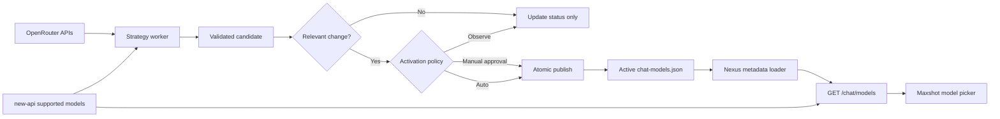

# Maxshot Nexus Model Strategy Integration Guide

## 1. Goal

Integrate the tested model-selection strategy into Maxshot Nexus so that the web chat exposes 30 useful OpenRouter models, grouped by category, without making user requests wait for OpenRouter.

This document assumes:

- the prototype in `model-strategy` is the source of truth for filtering and scoring;
- the dashboard remains a separate development/admin tool and is not added to Maxshot web;
- Maxshot Nexus continues to obtain the models a user can actually access from new-api;
- OpenRouter prices are selection inputs, not Maxshot billing prices;
- production starts in observe-only mode, then manual activation, before optional automatic activation.

## 2. Current Nexus integration points

| Area | File | Current role |
| --- | --- | --- |
| Metadata loading | `apps/adapter/src/services/manual-model-metadata.ts` | Loads `chat-models.json` from `MAXSHOT_MODEL_METADATA_URL`, with a local environment fallback and TTL cache. |
| Metadata merge | `apps/adapter/src/services/model-metadata-provider.ts` | Combines manual metadata with optional OpenRouter-derived capabilities. |
| Chat catalog | `apps/adapter/src/services/model-catalog.ts` | Intersects enabled metadata with models returned by new-api and builds the chat list. |
| Chat endpoint | `apps/adapter/src/services/app-routes-user.ts` | Serves `GET /chat/models`; its current limit of 50 already accommodates 30 models. |
| Web model picker | `apps/web/src/components/model-picker.tsx` | Groups models in the desired category order. |
| Web data loading | `apps/web/src/store.ts` | Loads the chat catalog from `GET /chat/models`. |

The existing `GET /chat/models` request path must remain fast and must not fetch OpenRouter data.

## 3. Selection policy

### 3.1 Output size and category quotas

The active list contains exactly 30 unique models.

| Category | Count | Purpose |
| --- | ---: | --- |
| Flagship | 8 | Leading general-purpose models |
| Reasoning | 4 | Models optimized for complex reasoning |
| Balanced | 8 | Strong capability/cost tradeoff |
| Economy | 4 | Low-cost everyday use |
| Code | 3 | Software development tasks |
| Free | 3 | Models with zero input and output price |

Display order is the table order above. Models within a category are sorted alphabetically by model ID. They are not ranked within the category.

### 3.2 Hard eligibility gates

A model is eligible only when all of the following are true:

1. It supports text input and text output.
2. Both input and output prices are present and non-negative.
3. Context length is at least 32,000 tokens.
4. It is not scheduled to expire within 14 days.
5. OpenRouter reports a top provider.
6. At least one provider endpoint passes the exact health rule in section 3.6.
7. The model ID is not an OpenRouter router/alias, stealth model, alpha/beta model, or dynamic variant ending in `:nitro`, `:floor`, `:thinking`, or `:extended`.
8. The model is present in the system-wide new-api supported-model list used by the strategy worker.

Gate 8 is required before category allocation. Otherwise the strategy can select 30 models while Nexus silently returns fewer than 30 after its new-api intersection.

The exact prototype exclusion pattern, tested against the concatenated model ID and name, is:

```regex
/(^openrouter\/|^stealth\/|\b(alpha|beta)\b|:(nitro|floor|thinking|extended)$)/i
```

The model ID must also be a string containing `/`. Input/output modality checks use exact `text` array membership. Expiration is rejected when a valid `expiration_date` parses to a time earlier than `now + 14 days`; an absent expiration is allowed. `top_provider` must be truthy.

### 3.3 Exact category qualification

Category qualification happens after normalization. A model may qualify for more than one category.

| Category | Exact qualification rule |
| --- | --- |
| Free | `inputPrice === 0 && outputPrice === 0` |
| Code | Paid model, and either its ID/name matches `/code|coder|codestral|devstral|programming/i` or its Artificial Analysis `coding_index >= 55` |
| Flagship | Paid model from an approved flagship provider, and at least one of: `intelligence_index >= 40`, weekly rank 1–25, monthly rank 1–25, or age no more than 30 days |
| Reasoning | Paid model that advertises `reasoning`, `include_reasoning`, or `reasoning_effort` in `supported_parameters`, and at least one of: `intelligence_index >= 25`, weekly rank 1–75, or monthly rank 1–75 |
| Economy | Paid model whose weighted price percentile is at most 0.40 |
| Balanced | Any paid model that passes the hard gates |

The exact flagship provider IDs are:

```text
anthropic
deepseek
google
minimax
mistralai
moonshotai
openai
qwen
x-ai
z-ai
```

The provider ID is the part of the model ID before the first `/`. Matching is exact and case-sensitive after OpenRouter normalization.

Prices are converted from OpenRouter's per-token strings to dollars per one million tokens:

```text
inputPrice  = Number(pricing.prompt)     × 1,000,000
outputPrice = Number(pricing.completion) × 1,000,000
weightedPrice = 0.4 × inputPrice + 0.6 × outputPrice
```

Sort every model with finite prices by `weightedPrice` ascending. For zero-based position `i` among `N` priced models:

```text
pricePercentile = i / max(1, N - 1)
```

The economy pool is `pricePercentile <= 0.40`. To reproduce the prototype exactly, `N` includes every finite-priced model in the weekly source before other hard-gate failures are removed.

### 3.4 Category allocation and overlap resolution

Filter out hard-gate failures, then sort candidates by total score descending and model ID ascending as the deterministic tie-breaker. Fill quotas in this exact order:

```text
free → code → flagship → reasoning → economy → balanced
```

For each category:

1. take candidates eligible for that category that have not already been selected;
2. choose the first `quota[category]` candidates from the score-sorted list;
3. assign that category and mark their IDs as selected;
4. record a shortage if fewer than the quota are available.

This order is intentionally different from display order. It prevents a free code model from consuming a Code seat, gives paid specialist Code models priority over Flagship/Balanced, and leaves Balanced as the final paid catch-all. Never select the same model twice. Any shortage invalidates the entire candidate; do not publish a partial list.

### 3.5 OpenRouter sources and normalization

Use `https://openrouter.ai/api/v1` and fetch these six source requests in parallel, each with a 20-second timeout:

```text
GET /models?sort=top-weekly
GET /models?sort=newest
GET /models?sort=intelligence-high-to-low
GET /models?sort=throughput-high-to-low
GET /models?sort=latency-low-to-high
GET /datasets/rankings-daily?start_date=YYYY-MM-DD&end_date=YYYY-MM-DD&modality=text
```

The monthly window is the previous 30 complete UTC days: `end_date` is yesterday UTC and `start_date` is 29 days before it, both inclusive.

Important normalization rules:

- The weekly response is the candidate universe. Models appearing only in another sorted response are not candidates.
- Weekly, newest, intelligence, throughput, and latency rank are the model's one-based array positions in their respective responses, keyed by exact model ID.
- For monthly usage, ignore rows whose `model_permaslug` is missing or equals `other`; sum `total_tokens` by `model_permaslug`, sort totals descending, and assign one-based ranks.
- Match monthly rank using `canonical_slug` first and model ID second.
- Convert numeric strings with `Number`; non-finite values become missing.
- `name` falls back to model ID, `canonical_slug` falls back to model ID, and missing `context_length` becomes zero.
- Age is `floor((now - created × 1000) / 86,400,000)`, clamped to zero. The prototype treats a missing/invalid `created` value as age zero; preserve this for exact parity or change it only as an explicitly approved strategy revision.
- Reasoning support is true only for the three exact `supported_parameters` values listed in section 3.3.

Every request sends `Accept: application/json` and `Authorization: Bearer <OPENROUTER_API_KEY>`. Keep identifying `HTTP-Referer` and `X-Title` headers configurable for the production Maxshot deployment.

If any of the six source requests fails, reject the update and keep the previous snapshot.

### 3.6 Endpoint availability verification

After static hard gates and the new-api eligibility intersection, call this endpoint for every remaining candidate:

```text
GET /models/:author/:slug/endpoints
```

Use concurrency 5 and the same 20-second request timeout. An endpoint is healthy when:

```text
(status is missing, null, or 0)
AND
(uptime_last_1d is missing/non-numeric OR uptime_last_1d >= 95)
```

Model health is calculated as follows:

- `available`: at least one healthy endpoint exists;
- `healthyEndpointCount`: number of healthy endpoints;
- `uptime`: maximum numeric `uptime_last_1d` among healthy endpoints;
- if healthy endpoints exist but none reports numeric uptime, use 95;
- if none is healthy, use uptime 0 and reject the model.

An individual endpoint-request failure marks that model verified but unavailable; it does not abort the whole source snapshot. The portfolio can still be produced if the remaining models fill every category quota. If they cannot, candidate validation fails and the active list remains unchanged.

### 3.7 Exact scoring formula

Scoring chooses models after the hard gates pass. Every component is normalized to `[0, 1]`; the weighted sum is therefore `[0, 100]` with default weights.

| Signal | Weight | Component calculation |
| --- | ---: | --- |
| Weekly usage | 25 | `rankScore(weeklyRank, weeklyCount)` |
| Monthly usage | 20 | `rankScore(monthlyRank, monthlyModelCount)` |
| Recently launched | 15 | `exp(-ageDays / 30)` |
| Quality/intelligence | 15 | Normalized `intelligence_index`; if absent, intelligence rank score |
| Endpoint reliability | 10 | Verified uptime divided by 100 and clamped to `[0,1]`; otherwise 0.5 |
| Performance | 10 | Average of throughput rank score and latency rank score |
| Value | 5 | `1 - pricePercentile` |

Rank normalization is:

```text
rankScore(rank, count) = 0                                      when rank is missing or count < 2
rankScore(rank, count) = max(0, 1 - (rank - 1) / (count - 1))  otherwise
```

Quality normalization is:

```text
normalize(value, min, max) = 0                                      when value is missing or max <= min
normalize(value, min, max) = clamp((value - min) / (max - min), 0, 1) otherwise
```

For exact prototype parity, quality bounds come from available `intelligence_index` values in the weekly candidate response, with the range forced to include 0 and 100. If a candidate has no `intelligence_index`, use its rank from the intelligence-sorted response instead.

The total is:

```text
score = 25×weekly + 20×monthly + 15×newModel + 15×quality
      + 10×reliability + 10×performance + 5×value
```

Strategy configuration is valid only when category quotas are non-negative integers totaling 30 and scoring weights are finite, non-negative numbers totaling 100. Production validation should enforce the finite/non-negative weight rule even though the prototype UI already constrains it.

Scores determine which models fill each quota. Scores and source ranks are evidence only; they do not define the order shown inside a category.

### 3.8 Determinism and display order

For identical source data, configuration, current time, and new-api availability, selection must be deterministic:

- score ties are broken by model ID ascending;
- output/display category order is `flagship`, `reasoning`, `balanced`, `economy`, `code`, `free`;
- model IDs are alphabetical within each category;
- there is no rank within a category.

Keep the score-sorted working array internal. Reorder only the final selected result and exported metadata for display/transport.

### 3.9 Normative selection pseudocode

The implementation should be equivalent to:

```ts
const sources = await fetchSixSourcesInParallel();
const preliminary = normalizeWeeklyUniverse(sources, now);

const staticallyEligible = preliminary.filter((model) =>
  model.staticHardGateReasons.length === 0 &&
  newApiSupportedIds.has(model.id),
);

const health = await checkEndpoints(staticallyEligible, { concurrency: 5, timeoutMs: 20_000 });
const candidates = addHealthEligibilityAndScores(preliminary, sources, health)
  .filter((model) => newApiSupportedIds.has(model.id));

const pool = candidates
  .filter((model) => model.hardGateReasons.length === 0)
  .sort((a, b) => b.score - a.score || a.id.localeCompare(b.id));

const selectedIds = new Set<string>();
const selected = [];

for (const category of ["free", "code", "flagship", "reasoning", "economy", "balanced"]) {
  const matches = pool.filter((model) =>
    !selectedIds.has(model.id) && model.eligibility[category],
  );
  const chosen = matches.slice(0, quotas[category]);
  if (chosen.length !== quotas[category]) throw new PortfolioIncompleteError(category);
  for (const model of chosen) {
    selectedIds.add(model.id);
    selected.push({ ...model, category });
  }
}

assert(selected.length === 30 && selectedIds.size === 30);
return selected.sort(byDisplayCategoryThenModelId);
```

Do not silently fill one category's shortage with surplus from a different category. The exact category composition is part of the strategy contract.

## 4. Recommended architecture

Use a background strategy worker and retain the existing Nexus request path:



Separate two states:

- **Candidate:** the newest calculated list and its evidence.
- **Active:** the version currently consumed by Maxshot users.

In the prototype, Refresh only recalculates against the latest completed snapshot; it never fetches OpenRouter. In Nexus manual mode, keep recalculation and activation as separate operations: the scheduled worker creates the candidate, while the protected activation action publishes it. Neither operation belongs in `GET /chat/models`.

### 4.1 Deployment choice

For the first integration, keep `chat-models.json` as the active artifact because Nexus already supports it. Run the strategy as a dedicated worker or scheduled job that publishes the artifact atomically.

Do not run an independent in-memory timer in every Adapter replica. In a multi-replica deployment, use one of:

- a dedicated worker process;
- a platform cron job;
- a distributed lock around the scheduled job.

Recommended production refresh interval: 60 minutes, configurable. The five-minute interval is useful only for prototype testing.

## 5. Nexus implementation plan

### Step 1: Extract the strategy as server-side modules

Add a focused directory:

```text
apps/adapter/src/services/model-strategy/
  openrouter-client.ts
  selection.ts
  fingerprint.ts
  scheduler.ts
  publisher.ts
  types.ts
```

Responsibilities:

- `openrouter-client.ts`: fetch and normalize source data with timeouts.
- `selection.ts`: hard gates, scoring, category assignment, quotas, and deterministic output ordering.
- `fingerprint.ts`: determine whether activation is required.
- `scheduler.ts`: single-job scheduling and status tracking.
- `publisher.ts`: validate and atomically replace the active artifact.
- `types.ts`: source, candidate, status, and artifact contracts.

Port the tested strategy logic without changing its weights or quotas during the integration.

The worker run order must be:

1. fetch all six OpenRouter source datasets in parallel;
2. normalize the weekly candidate universe and apply static hard gates;
3. intersect with the system-wide new-api supported-model IDs;
4. verify endpoints for remaining candidates with concurrency 5;
5. recompute candidates with health data;
6. score, allocate, and validate exactly 30 models;
7. order by category and model ID;
8. build candidate metadata and fingerprints;
9. store status/candidate, then activate only under the configured policy.

### Step 2: Intersect with new-api before selection

Pass the authenticated/system supported-model IDs into selection as an eligibility set. If authentication-specific availability varies by user, use the system-wide enabled set for strategy selection and keep the existing per-user intersection in `/chat/models`.

Selection must backfill the next eligible model in the same category when a candidate is unavailable in new-api.

Model IDs must match exactly across OpenRouter, new-api, the metadata artifact, and `/chat/models`; do not normalize aliases or strip suffixes. Log unavailable IDs so naming mismatches are visible.

### Step 3: Generate a compatible metadata artifact

Each selected model remains keyed by OpenRouter model ID:

```json
{
  "anthropic/claude-sonnet-4.5": {
    "displayName": "Claude Sonnet 4.5",
    "description": "General-purpose model",
    "tier": "flagship",
    "chatEnabled": true,
    "recommended": false,
    "chatDefault": false,
    "contextLength": 200000,
    "capabilities": {
      "files": true,
      "vision": true,
      "audio": false,
      "webSearch": true,
      "reasoning": true
    },
    "requestPatches": {
      "webSearch": {
        "tools": [
          {
            "type": "openrouter:web_search",
            "parameters": { "engine": "exa", "max_results": 5 }
          }
        ]
      },
      "reasoning": {
        "reasoning": { "effort": "medium" }
      }
    },
    "selection": {
      "strategyVersion": 1,
      "selectedAt": "2026-08-25T12:00:00.000Z",
      "score": 82.4,
      "weeklyRank": 3,
      "monthlyRank": 5,
      "newestRank": 12,
      "intelligenceRank": 7,
      "openRouterInputPricePerMillion": 3,
      "openRouterOutputPricePerMillion": 15
    }
  }
}
```

The `selection` block is provenance for operators. It must not replace the live new-api pricing used by Nexus for user billing or credit estimates.

Extend `ModelMetadataEntry` with the optional `selection` type only if Nexus needs to expose this evidence in an internal endpoint. The public `/chat/models` response does not need it.

Derive generated fields exactly as follows:

- `displayName`: OpenRouter `name`, falling back to model ID;
- `description`: OpenRouter description, unless manually overridden;
- `tier`: assigned strategy category;
- `chatEnabled`: always `true` for the 30 selected IDs;
- `contextLength`: normalized OpenRouter context length;
- `capabilities.files`: input modalities contain `file`;
- `capabilities.vision`: input modalities contain `image`;
- `capabilities.audio`: input modalities contain `audio`;
- `capabilities.webSearch`: `true` because the standard OpenRouter web-search patch is generated;
- `capabilities.reasoning`: normalized reasoning support from section 3.3;
- `requestPatches.webSearch`: the exact Exa tool shown above;
- `requestPatches.reasoning`: include `{ reasoning: { effort: "medium" } }` only when reasoning is supported;
- selection prices: the normalized OpenRouter prices per one million tokens used by the activation fingerprint.

Before generating the active artifact, start from the existing metadata map, set `chatEnabled: false` for previously selected IDs that are no longer selected, merge generated fields for the new 30, then apply manual overrides. This prevents removed models from remaining chat-enabled and preserves unrelated metadata used elsewhere in Nexus. If `chat-models.json` is intentionally chat-only, replacing it with exactly the new 30 entries is also valid, but choose one artifact policy and test it; do not mix the two behaviors.

### Step 4: Remove performance ranking from display order

Update `buildChatModelCatalog` to sort by:

1. category order: `flagship`, `reasoning`, `balanced`, `economy`, `code`, `free`;
2. model ID alphabetically within the category.

Do not sort the selected list by score or source rank.

For a lowest-risk transition, `chatRank` may temporarily remain in the JSON as a compatibility ordering field derived only from category and alphabetical position. It must not be described as a model rank. Remove it after all consumers use category ordering directly.

If compatibility `chatRank` is retained, generate it deterministically from category bases plus alphabetical position, for example Flagship 100+, Reasoning 200+, Balanced 300+, Economy 400+, Code 500+, and Free 600+. It must not be derived from score.

### Step 5: Preserve manual product decisions

Dynamic selection should own:

- `chatEnabled`;
- `tier`;
- discovered capabilities and context length;
- selection provenance.

A small manual override layer should own or override:

- `chatDefault`;
- `recommended`;
- user-facing descriptions;
- request patches;
- zero-retention policy and other Maxshot-specific behavior.

Manual overrides win when metadata is merged. Preserve the current default if it is still selected; otherwise apply the fallback chain below. Validate that exactly one active model is the default.

Use this complete default-selection fallback chain:

1. a manually configured default, if it is selected;
2. the previous active default, if it is still selected;
3. the highest-scoring healthy model assigned to Balanced or Economy;
4. the highest-scoring healthy selected model overall.

For `recommended`, retain valid manual selections. If none remains selected, mark the highest-scoring Flagship model, falling back to the highest-scoring selected model. This reproduces the prototype fallback while allowing Maxshot product overrides. Clear stale `chatDefault` and `recommended` flags before applying these rules.

### Step 6: Add scheduling and safe publication

Minimum configuration:

```text
MODEL_STRATEGY_ENABLED=false
MODEL_STRATEGY_MODE=observe
MODEL_STRATEGY_REFRESH_INTERVAL_MS=3600000
OPENROUTER_API_KEY=...
```

Supported modes:

- `observe`: calculate and report candidates; never change the active artifact.
- `manual`: store a changed candidate and require an admin activation action.
- `auto`: atomically activate a valid changed candidate.

Run an update immediately when the worker starts, then schedule the next run from the completion time. Only one update may run at once. Continue serving the previous active artifact while an update is running or after an update fails.

Clamp the interval to at least 60 seconds. Use a recursive one-shot timer scheduled after each run completes, not `setInterval`, so slow updates cannot overlap. Concurrent callers must share the same in-flight promise/job.

Build the complete new snapshot off to the side. Swap the candidate snapshot only after source fetching, endpoint checks, normalization, and selection validation succeed. A source-level failure keeps the previous snapshot; individual endpoint failures follow section 3.6.

Track this minimum status contract:

```ts
type ModelStrategyStatus = {
  updating: boolean;
  updateStartedAt: string | null;
  lastUpdatedAt: string | null;
  nextUpdateAt: string | null;
  lastDurationMs: number | null;
  lastError: string | null;
  dataChangedSincePrevious: boolean | null;
  selectionChangedSincePrevious: boolean | null;
  activationRequired: boolean;
  lastChangedAt: string | null;
  unchangedUpdateCount: number;
  activeVersion: string | null;
  candidateVersion: string | null;
};
```

`lastUpdatedAt` means the newest successfully completed basic-data snapshot, not the last activation. Store activation time separately in artifact/version metadata. During a failed update, retain the last successful timestamp and active/candidate payload while updating `lastError` and `lastDurationMs`.

`selectionChangedSincePrevious` compares the latest candidate with the immediately preceding candidate and is diagnostic only. `activationRequired` must compare the latest valid candidate fingerprint with the active fingerprint. It stays `true` across later unchanged background updates until that candidate-equivalent selection is activated; activating it sets the value to `false`. Never derive the operator recommendation only from the previous-snapshot comparison, because that can incorrectly clear a still-pending activation.

The production equivalent of prototype `POST /api/strategy` must only recompute configuration against the latest completed snapshot. It must not call OpenRouter. The scheduled worker is the only normal trigger for upstream fetching.

### Step 7: Invalidate metadata after activation

The current manual metadata loader may cache `chat-models.json` for five minutes. After an activation, either:

- explicitly invalidate the cache when the worker and Adapter share a process; or
- use an artifact version/ETag and accept the configured TTL delay when the publisher is separate.

The end-user web app requires no new polling behavior for the initial integration. Its next normal `/chat/models` load receives the active catalog.

For the minimal deployment, publish immutable versioned artifacts to shared storage and expose the active version at `MAXSHOT_MODEL_METADATA_URL`. Switch the active object/pointer only after validation. Keep at least the previous known-good version for rollback. A Git-backed `gateway-config/chat-models.json` publication is acceptable for observe/manual mode; automatic mode requires service credentials and an atomic publication path, not a working-tree write from an Adapter replica.

## 6. When activation is required

Create a canonical fingerprint from the selected output:

```ts
const fingerprint = selected
  .map((model) => [
    model.id,
    model.category,
    model.openRouterInputPricePerMillion,
    model.openRouterOutputPricePerMillion,
  ])
  .sort(([left], [right]) => left.localeCompare(right));
```

Activation is required only when at least one of these changes:

- selected model membership;
- assigned category;
- OpenRouter input price;
- OpenRouter output price.

Activation is not required for changes to:

- score;
- weekly or monthly usage rank;
- launch age;
- intelligence, latency, throughput, or reliability evidence;
- ordering within a category.

The candidate evidence and update timestamp can still be stored when the active fingerprint is unchanged.

Always compare candidate versus active for the activation decision:

```text
activationRequired = candidate.selectionFingerprint !== active.selectionFingerprint
```

Comparing candidate N only with candidate N−1 is useful for update diagnostics, but it is not sufficient for activation state. A pending recommendation must remain visible until activation or until a later candidate again matches the active fingerprint.

Keep a second, diagnostic basic-data fingerprint separate from the activation fingerprint. Canonicalize candidates by model ID and include decision inputs such as name/canonical slug, prices, context, age, source ranks, reasoning support, category eligibility, hard-gate results, endpoint availability/count/uptime, input modalities, and supported parameters. It powers “basic data unchanged” versus “basic data changed, Top 30 unchanged”; it must never trigger activation by itself.

When comparing an activated list with its predecessor, report:

- `added`: IDs present only in the new list;
- `removed`: IDs present only in the old list;
- `categoryChanged`: same ID with a different category;
- `priceChanged`: same ID with a different normalized input or output price.

The dashboard can highlight New, Category, and Price on rows in the new list until the next recalculation. Removed models require a separate change summary because they no longer have rows. Rank, score, age, and evidence changes must not be highlighted as activation changes.

## 7. Validation before publication

Reject a candidate unless all checks pass:

- exactly 30 entries;
- 30 unique model IDs;
- exact category quotas;
- every model passes all eligibility gates;
- every model is supported by new-api;
- all input and output prices are known;
- every model has at least one healthy verified endpoint;
- output order is category then alphabetical model ID;
- manual overrides produce exactly one default;
- no stale removed model remains `chatEnabled: true`;
- the activation fingerprint stored with the artifact matches its 30 entries;
- generated JSON conforms to the Nexus metadata contract.

Publication must be atomic: write and validate a candidate version first, then switch the active pointer/file. Never overwrite the active artifact with partial data.

## 8. Internal operational API

If manual mode is implemented inside Nexus, add protected internal/admin endpoints only:

```text
GET  /internal/model-strategy/status
GET  /internal/model-strategy/candidate
POST /internal/model-strategy/activate
```

Status should include:

- update state and countdown;
- last success and duration;
- last error;
- active and candidate versions;
- whether raw source data changed;
- whether the activation fingerprint changed;
- added, removed, category-changed, and price-changed model IDs.

Do not expose the OpenRouter API key or raw provider responses.

`POST /internal/model-strategy/activate` must require an authenticated admin/internal authorization check, accept the expected candidate version, and return a conflict if a newer candidate has replaced it. This prevents an operator from activating a stale review. Activation is idempotent when that version is already active.

## 9. Failure behavior and observability

On any fetch, validation, or publication failure:

1. keep the current active list;
2. record the error and duration;
3. schedule the next normal attempt;
4. alert only after the configured operational threshold.

Record at least these metrics/log fields:

- update duration and result;
- source model count and eligible model count;
- selected count by category;
- endpoint-check count and failures;
- activation-relevant change count;
- active artifact version and age.

The OpenRouter API key must remain server-side. Do not put it in web environment variables, generated artifacts, logs, or error responses.

## 10. Test plan

### Unit tests

- exact blocked-ID/name regex and every individual hard gate;
- price conversion, weighted price, percentile boundary at 0.40, and free-price equality;
- flagship provider allowlist and each OR condition;
- Code regex/coding-index threshold and Reasoning parameter/intelligence/rank thresholds;
- overlapping category eligibility and exact allocation order;
- rank, recency, quality, reliability, performance, value, and total-score formulas;
- monthly token aggregation by canonical slug and all rank maps;
- exact quotas, shortage rejection, uniqueness, and deterministic score tie-breaking;
- category/alphabetical output order;
- fingerprint detects membership, category, and price changes;
- fingerprint ignores score, source rank, age, and order changes;
- manual default preservation and the complete fallback chain;
- generated capabilities and request patches.

### Integration tests

- all OpenRouter sources are normalized into one snapshot;
- endpoint concurrency and timeouts are enforced;
- source failure retains the previous snapshot;
- endpoint-request failure excludes only that model;
- new-api intersection occurs before quota allocation;
- an incomplete category is backfilled correctly;
- invalid candidates never replace the active artifact;
- unchanged fingerprints do not publish;
- changed candidates publish atomically;
- activation remains required when consecutive candidates match each other but still differ from active;
- activation clears when candidate and active fingerprints match;
- stale candidate activation returns a conflict;
- removed models are no longer chat-enabled;
- metadata cache returns stale active data during refresh/failure.

### Nexus route and web tests

- `GET /chat/models` returns at most and normally exactly 30 selected models;
- unavailable per-user models are still removed by the existing access check;
- category order matches the strategy;
- IDs are alphabetical within each category;
- exactly one default exists;
- the model picker renders all categories without a rank concept;
- when a user's previous model disappears, existing fallback behavior selects an available model.

Suggested verification commands:

```bash
pnpm --filter @maxshot/adapter test
pnpm --filter @maxshot/adapter build
pnpm --filter @maxshot/web build
```

Also update tests or documentation that still assert the historical 24-model limit. The current route limit of 50 does not need changing for a 30-model catalog.

## 11. Rollout and rollback

### Phase 1: Observe

- Deploy with `MODEL_STRATEGY_MODE=observe`.
- Run for one to two weeks.
- Review update duration, failures, quota stability, and differences from the current list.

### Phase 2: Manual activation

- Enable candidate storage and protected activation.
- Review only membership, category, and price changes.
- Activate validated candidates and monitor chat errors and model availability.

### Phase 3: Automatic activation

- Enable only after manual operation is stable.
- Keep all validation gates and atomic publication.
- Continue retaining the previous known-good artifact.

Rollback consists of disabling the strategy and switching the active artifact to the previous version. It must not require a new OpenRouter fetch.

## 12. Acceptance criteria

Integration is complete when:

- Maxshot web receives 30 models from `/chat/models` under normal availability;
- category quotas and ordering match this document;
- user requests never wait for OpenRouter strategy refreshes;
- failed refreshes do not affect the active catalog;
- only membership, category, or OpenRouter price changes request activation;
- scoring/ranking/evidence changes do not request activation;
- new-api remains the authority for user access and billing prices;
- the active catalog can be rolled back to its previous version;
- the standalone dashboard remains usable for strategy demonstration and diagnosis.

## 13. Deliberate non-goals for the first integration

- Adding the prototype dashboard to Maxshot web.
- Replacing new-api billing prices with OpenRouter prices.
- Overriding a still-valid manual default or recommendation merely because strategy scores changed.
- Calling OpenRouter from `/chat/models` or any user chat request.
- Treating ordering within a category as model ranking.
